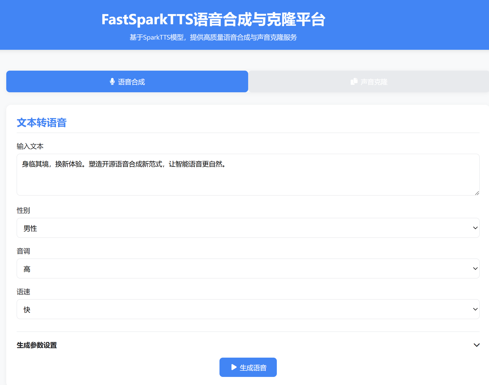
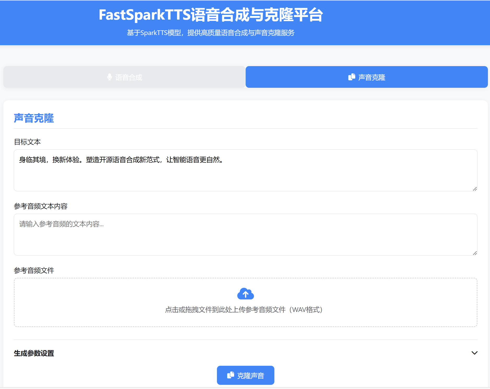

# FastSparkTTS Voice Synthesis and Cloning Platform 🔊

[中文](README.MD) | [English](README_EN.MD)

> 🚀 **FastSparkTTS** – Based on the SparkTTS model, this platform provides high-quality Chinese voice synthesis and
> voice cloning services. With an easy-to-use web interface, you can effortlessly create natural and realistic human
> voices to meet a variety of needs.

## ✨ Features

- 🚀 **Multiple Backend Acceleration:** Supports various acceleration engines including `vllm`, `sglang`, and `llama-cpp`
- 🎯 **High Concurrency:** Utilizes dynamic batching to significantly improve throughput
- 🎛️ **Full Parameter Control:** Adjust parameters such as pitch, speech rate, timbre temperature, etc.
- 📱 **Lightweight Deployment:** Minimal dependencies with a fast startup based on Flask and FastAPI
- 🎨 **Clean Interface:** A standard, modern UI

## 🖼️ Interface Preview

<div align="center">
  <table>
    <tr>
      <td></td>
      <td></td>
    </tr>
    <tr>
      <td align="center"><strong>Voice Synthesis</strong></td>
      <td align="center"><strong>Voice Cloning</strong></td>
    </tr>
  </table>
</div>

## 🛠️ Quick Start

### Environment Requirements

- Python 3.10+
- Flask 2.0+
- FastAPI
- vllm **or** sglang **or** llama-cpp

### Install Dependencies

```bash
pip install -r requirements.txt
```

Install an inference engine (choose one as needed):

- **vLLM**

  The vllm version must be greater than `0.7.2`.
    ```bash
    pip install vllm
    ```
  For more details, refer to: [vLLM on GitHub](https://github.com/vllm-project/vllm)


- **llama-cpp**
    ```bash
    pip install llama-cpp-python
    ```
  Convert the LLM weights to gguf format, save the file as `model.gguf`, and place it in the `LLM` directory. You can
  refer to the example below for weight conversion—adjust parameters as needed for quantization.
    ```bash
    git clone https://github.com/ggml-org/llama.cpp.git
    
    cd llama.cpp
    
    python convert_hf_to_gguf.py Spark-TTS-0.5B/LLM --outfile Spark-TTS-0.5B/LLM/model.gguf
    ```

- **sglang**

    ```bash
    pip install sglang
    ```

  For more details, refer to: [sglang on GitHub](https://github.com/sgl-project/sglang)

### Download Weights

Download weights from the following links:  
[huggingface](https://huggingface.co/SparkAudio/Spark-TTS-0.5B)
and [modelscope](https://modelscope.cn/models/SparkAudio/Spark-TTS-0.5B)

### Starting Up

1. Clone the project repository:
    ```bash
    git clone https://github.com/HuiResearch/Fast-Spark-TTS.git
    cd Fast-Spark-TTS
    ```

2. Start the SparkTTS API service:
    ```bash
    python server.py \
    --model_path Spark-TTS-0.5B \
    --engine vllm \
    --llm_device cuda \
    --audio_device cuda \
    --vocoder_device cuda \
    --wav2vec_attn_implementation sdpa \
    --max_length 32768 \
    --llm_gpu_memory_utilization 0.6 \
    --host 0.0.0.0 \
    --port 8000
    ```

3. Start the Web interface:
    ```bash
    python frontend.py
    ```

4. Open your browser and visit:
    ```
    http://localhost:8001
    ```

## 🚀 Usage Guide

### Voice Synthesis

1. Switch to the "Voice Synthesis" tab.
2. Enter the text you want to convert to speech.
3. Adjust parameters such as gender, pitch, and speech rate.
4. Click the "Generate Voice" button.
5. Once processing is complete, play or download the audio.

### Voice Cloning

1. Switch to the "Voice Cloning" tab.
2. Enter the target text.
3. Upload a reference audio file.
4. Provide the text corresponding to the reference audio.
5. Adjust the desired parameters.
6. Click the "Clone Voice" button.
7. After cloning, play or download the audio.

## Inference Speed

**GPU:** A800

Using [prompt_audio.wav](example/prompt_audio.wav) to test the cloning speed, the process runs five inference loops and
calculates the average inference time (in seconds).

Refer to the test code in [speed_test.py](speed_test.py).

When using vllm, most of the processing time is spent on the audio tokenizer and vocoder rather than the LLM, so further
optimization with ONNX might be possible.

|  engine   | device | Avg Time | Avg Time (warm up) |
|:---------:|:------:|:--------:|:------------------:|
| Official  |  CPU   |  27.20   |       27.30        |
| Official  |  GPU   |   5.95   |        4.97        |
| llama-cpp |  CPU   |  11.32   |       11.09        |
|   vllm    |  GPU   |   1.95   |        1.22        |
|  sglang   |  GPU   |   3.41   |        0.76        |

## Local Usage

Refer to [inference.py](inference.py) for usage instructions.

For API deployment and loop inference, using asynchronous (async) methods is recommended.

**Note:** The first inference with backends such as vllm and sglang may take longer, but subsequent inferences will be
normal. If you are benchmarking, it is recommended to warm up using the first data entry.

## Reference

1. [Spark-TTS](https://github.com/SparkAudio/Spark-TTS)

## License and Attribution

This project is built upon [Spark-TTS](https://github.com/SparkAudio/Spark-TTS) and is distributed under the same open
source license as SparkTTS. Please refer to the
original [SparkTTS LICENSE](https://github.com/SparkAudio/Spark-TTS/blob/main/LICENSE) for details.